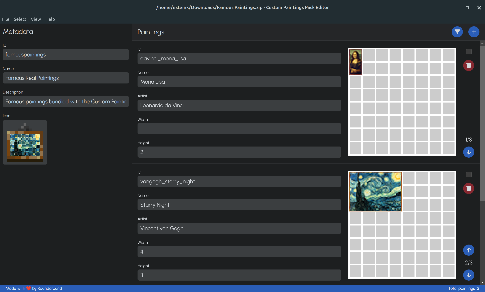

# Custom Paintings Pack Editor

Utility for creating special resource packs for the
[Custom Paintings](https://modrinth.com/mod/roundaround-custom-paintings) mod
for Minecraft

Made with ❤️ by [Roundaround](https://www.github.com/roundaround)
